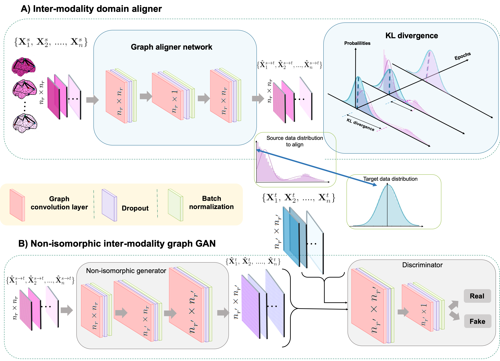
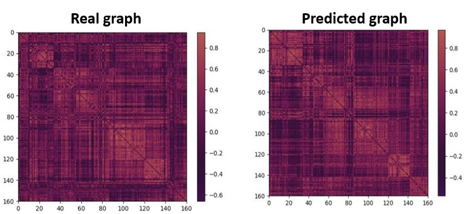

# IMANGraphNet
 IMANGraphNet (Non-isomorphic Inter-modality Graph Alignment and Synthesis for Holistic Brain Mapping), coded up in Python by Islem Mhiri. Please contact islemmhiri1993@gmail.com for inquiries. Thanks.

This repository provides the official PyTorch implementation of the following paper:

<p align="center">
  
</p>

> **Non-isomorphic Inter-modality Graph Alignment and Synthesis for Holistic Brain Mapping**
> [Islem Mhiri]<sup>1,2</sup>, [Ahmed Nebli]<sup>1,2</sup>,  [Mohamed Ali Mahjoub]<sup>2</sup>, [Islem Rekik]<sup>1</sup>(https://basira-lab.com/)

> <sup>1</sup>BASIRA Lab, Faculty of Computer and Informatics, Istanbul Technical University, Istanbul, Turkey

> <sup>2</sup>  Laboratory of Advanced Technology and Intelligent Systems, National Engineering School of Sousse, Tunisia

> **Abstract:** Brain graph synthesis marked a new era for predicting a target brain graph from a source one without incurring the high acquisition cost and processing time of neuroimaging data. However, works on recovering a brain graph in one modality (e.g., functional brain imaging) from a brain graph in another (e.g., structural brain imaging) remain largely scarce. Besides, existing multimodal graph synthesis frameworks have several limitations. First, they mainly focus on generating graphs from the same domain (intra-modality), overlooking the rich multimodal representations of brain connectivity (inter-modality). Second, they can only handle isomorphic graph generation tasks, limiting their generalizability to synthesizing target graphs with a different node size and topological structure from those of the source one. More importantly, both target and source domains might have different distributions, which causes a domain fracture between them (i.e., distribution misalignment). To address such challenges, we propose an inter-modality aligner of non-isomorphic graphs (IMANGraphNet) framework to infer a target graph modality based on a given modality. Our three core contributions lie in (i) predicting a target graph (e.g., functional) from a source graph (e.g., morphological) based on a novel graph generative adversarial network (gGAN); (ii) using non-isomorphic graphs for both source and target domains with a different number of nodes, edges and structure; and (iii) enforcing the source distribution to match that of the ground truth graphs using a graph aligner to relax the loss function to optimize. Furthermore, to handle the unstable behavior of gGAN, we design a new Ground Truth-Preserving (GT-P) loss function to guide the non-isomorphic generator in learning the topological structure of ground truth brain graphs more effectively. Our comprehensive experiments on predicting target functional brain graphs from source morphological graphs demonstrate the outperformance of IMANGraphNet in comparison with its variants. IMANGraphNet presents the first framework for brain graph synthesis based on aligned non-isomorphic inter-modality brain graphs which handles variations in graph size, distribution and structure. This can be further leveraged for integrative and holistic brain mapping as well as developing multimodal neurological disorder diagnosis frameworks.

This work is published in IPMI 2021, Bornholm, Denmark. IMANGraphNet is a geometric deep learning framework for inter-modality non-isomorphic brain graph synthesis, which
nicely handles variations in graph distribution, size and structure. Using an end-to-end learning fashion, it preserves the topological structure of each target graph. Our key contributions consist in designing: (1) a graph aligner network to align the training graphs of the source modality to that of the target one and (2) a non-isomorphic generator architecture that handles shifts in graph resolution (i.e., node size variation) coupled with an adversarial discriminator using GCNs. We have evaluated our method on SLIM dataset. Detailed information can be found in the original paper and the video in the BASIRA Lab YouTube channel. In this repository, we release the code for training and testing IMANGraphNet on a simulated dataset.

# Installation

The code has been tested with Python 3, PyTorch 1.3.1 on Ubuntu 16.04. GPU is required to run the code. You also need other dependencies (e.g., numpy, networkx) which can be installed via: 

```bash
pip install -r requirements.txt
```

# Training and testing IMANGraphNet

We provide a demo code for the usage of IMANGraphNet for a target graph prediction from a source graph. 

To evaluate our framework, we used 3 fold-cross-validation strategy.

You can train the program with the following command:

```bash
python main.py 
```

# Input data

In order to use our framework, you need to provide:

* a source matrix of size (m * f). We denote m the total number of subjects in the dataset and n the number of features. 

* a target matrix of size (m * f1 ). We denote m the total number of subjects in the dataset and n1 the number of features. 

* You need to include your data in the file main.py. So, just remove our simulated dataset and replace it with yours.

# Output Data

* a predicted tensor of size (m * n1 * n1) stacking the predicted brain graphs where m is the number of subjects and n1 is the number of regions of interest.
* a target tensor size (m × n1× n1 ) stacking the target brain graphs where m is the number of subjects and n1 is the number of regions of interest.
* a source tensor of size (m × n× n ) stacking the source brain graphs where m is the number of subjects and n is the number of regions of interest
# Example Results
In this example, we simulated a dataset with 150 samples where the number of regions of interest in the source domain = 35 and the number of regions of interest in the target domain = 160 using 3 fold-CV. 

<p align="center">
  
</p>


# YouTube video presentation of IMANGraphNet: 

https://www.youtube.com/watch?v=kzS-PkOt5_4&ab_channel=BASIRALab

# Paper link on arXiv

https://arxiv.org/abs/2107.06281

# Please cite the following paper when using IMANGraphNet:
```latex
@inproceedings{mhiri2021non,
  title={Non-isomorphic Inter-modality Graph Alignment and Synthesis for Holistic Brain Mapping},
  author={Mhiri, Islem and Nebli, Ahmed and Mahjoub, Mohamed Ali and Rekik, Islem},
  booktitle={International Conference on Information Processing in Medical Imaging},
  pages={203--215},
  year={2021},
  organization={Springer}
}
```

# License
Our code is released under MIT License (see LICENSE file for details).

# Contributing
We always welcome contributions to help improve IMANGraphNet and evaluate our framework on other types of graph data. If you would like to contribute, please contact islemmhiri1993@gmail.com. Many thanks.


